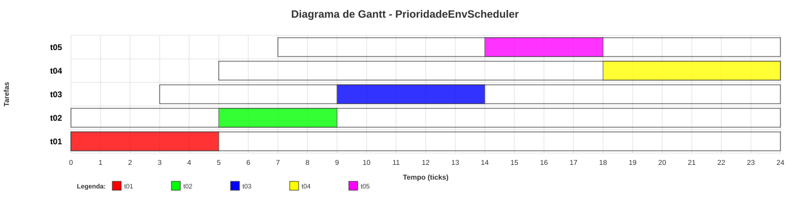

# Simulador SO

Simulador de escalonamento de processos para sistemas operacionais, escrito em Python puro (sem dependências externas). Recebe um cenário de tarefas em um arquivo de configuração texto, executa a simulação tick a tick e produz métricas de desempenho e um diagrama de Gantt (terminal e SVG).

Projeto pessoal desenvolvido para consolidar conceitos de Sistemas Operacionais — escalonamento de CPU, estados de processo e métricas de desempenho — através de uma implementação funcional em vez de apenas simulações teóricas.


## Índice

- [Funcionalidades](#funcionalidades)
- [Exemplo](#exemplo)
- [Como executar](#como-executar)
- [Formato do arquivo de configuração](#formato-do-arquivo-de-configuração)
- [Arquitetura](#arquitetura)
- [Estrutura do projeto](#estrutura-do-projeto)
- [Executável standalone](#executável-standalone)

## Funcionalidades

- **Algoritmos de escalonamento**: FIFO, SRTF (Shortest Remaining Time First), Prioridade preemptiva e Prioridade com Aging (envelhecimento dinâmico de prioridade para evitar starvation).
- **Simulação orientada a ticks**: um `Clock` global avança o tempo discretamente; cada tarefa é uma máquina de estados (`NOVO → PRONTO → EXECUTANDO → TERMINADO`, com suporte a preempção).
- **Duas formas de execução**: modo completo (roda até o fim e imprime as métricas) e modo passo-a-passo (debugger interativo — avança tick a tick, inspeciona o estado de qualquer tarefa e a fila de prontos a qualquer momento).
- **Métricas por tarefa**: turnaround time, waiting time, response time e número de preempções, além das médias do cenário.
- **Diagrama de Gantt**: renderização em ASCII no terminal e exportação para SVG (sem bibliotecas de gráficos — geração manual do SVG).
- **Parser de configuração próprio**: valida algoritmo, cores e IDs duplicados, reportando avisos não-fatais.
- **Factory de escalonadores**: novos algoritmos podem ser adicionados registrando uma classe na `SchedulerFactory`, sem alterar o restante do simulador.

## Exemplo

Cenário `examples/caso-teste-001.txt` (3 tarefas, escalonamento por Prioridade com Aging):

```
PRIOPEnv;3;1
t01;FF0000;0;5;2;
t02;00FF00;0;4;3;
t03;0000FF;3;5;5;
```

Rodando com `--modo completo`, o simulador imprime o tempo total de execução e uma tabela de métricas por tarefa (turnaround, espera e resposta, com as respectivas médias do cenário) e, em seguida, o diagrama de Gantt correspondente:



## Como executar

Requer apenas **Python 3.11+** — nenhuma dependência externa.

```bash
git clone https://github.com/vicenteseabra/simulador-so.git
cd simulador-so

# Executa um cenário até o fim e exporta o Gantt em SVG
python src/main.py examples/caso-teste-001.txt --modo completo --output caso1

# Modo passo-a-passo (debugger interativo)
python src/main.py examples/caso-teste-002.txt --modo passo

# Menu interativo (lista os cenários de exemplo por categoria)
python launcher.py
```

No modo passo-a-passo, os comandos disponíveis a cada tick são:

| Comando | Ação |
|---|---|
| `Enter` | Avança um tick |
| `status` | Mostra o estado atual de todas as tarefas |
| `info <id>` | Detalha uma tarefa específica |
| `continue` | Roda até o final sem mais pausas |
| `q` / `quit` | Encerra a simulação |

## Formato do arquivo de configuração

Arquivo texto delimitado por `;`. Primeira linha define o algoritmo; as seguintes definem as tarefas.

```
ALGORITMO;QUANTUM[;ALPHA]
ID;COR;INGRESSO;DURACAO;PRIORIDADE
```

- `ALGORITMO`: `FIFO`, `SRTF`, `PRIORIDADE` ou `PRIOPENV` (Prioridade com Aging — exige `ALPHA`, o incremento de envelhecimento por tick).
- `INGRESSO` / `DURACAO`: tempo de chegada e duração total (em ticks) da tarefa.
- `PRIORIDADE`: menor valor numérico = maior prioridade.

O `ConfigParser` valida o algoritmo escolhido, o formato das cores e a existência de IDs duplicados, reportando avisos não-fatais quando encontra inconsistências.

## Arquitetura

| Módulo | Responsabilidade |
|---|---|
| `src/task.py` | `Task` — bloco de controle de processo (PCB): estado, tempos, métricas, transições (`admitir`, `iniciar`, `preemptar`, `bloquear`). |
| `src/clock.py` | `Clock` — contador de tempo global da simulação. |
| `src/scheduler.py` | `Scheduler` (classe abstrata) e as implementações `FIFOScheduler`, `SRTFScheduler`, `PriorityPreemptiveScheduler`, `PrioridadeEnvScheduler`, mais a `SchedulerFactory`. |
| `src/simulator.py` | `Simulator` — orquestra o laço de simulação tick a tick: admissão, preempção, execução e coleta de histórico. |
| `src/config_parser.py` | `ConfigParser` — lê e valida os arquivos de cenário. |
| `src/gantt.py` | `GanttChart` — renderização do diagrama em ASCII e exportação em SVG. |
| `src/main.py` | Ponto de entrada via linha de comando (`argparse`). |
| `launcher.py` | Menu interativo em terminal, usado também como entrada do executável empacotado. |

## Estrutura do projeto

```
simulador-so/
├── src/
│   ├── main.py            # CLI
│   ├── simulator.py        # Laço principal da simulação
│   ├── scheduler.py         # Algoritmos de escalonamento
│   ├── task.py               # Modelo de processo
│   ├── clock.py
│   ├── config_parser.py
│   └── gantt.py
├── examples/              # Cenários de teste (caso-teste-001.txt ... 005.txt)
├── launcher.py            # Menu interativo
├── output/                # Diagramas de Gantt exportados (SVG)
└── dist/                  # Executáveis empacotados (PyInstaller)
```

## Executável standalone

O projeto também é distribuído como executável empacotado com PyInstaller (`dist/SimuladorSO.exe` no Windows), embutindo o menu interativo e os cenários de exemplo — não requer Python instalado para rodar.

## Licença

Distribuído sob a licença [MIT](LICENSE).
